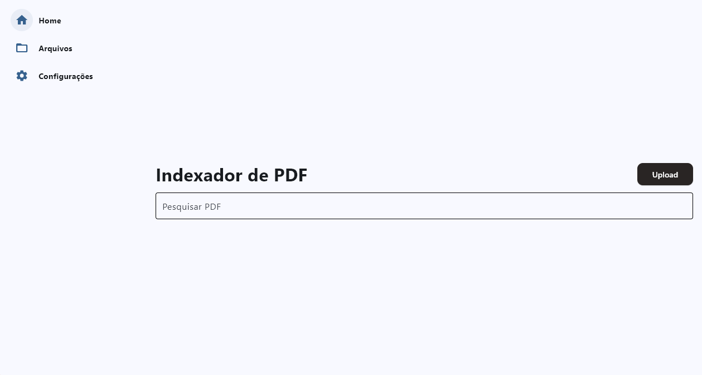

# Indexador de PDFs ✨

Uma aplicação de desktop construída com **Flet** para organizar, categorizar e pesquisar os seus documentos PDF de forma inteligente e eficiente.

---

  

---

## Índice
- [Sobre o Projeto](#sobre-o-projeto)
- [Principais Funcionalidades](#principais-funcionalidades)
- [Tecnologias Utilizadas](#tecnologias-utilizadas)
- [Estrutura do Projeto](#estrutura-do-projeto)
- [Como Executar](#como-executar)
- [Uso](#uso)
- [Licença](#licença)

---

## Sobre o Projeto
Este projeto foi criado para resolver o problema de gerir uma grande quantidade de ficheiros **PDF**.  
Em vez de procurar manualmente em pastas, esta aplicação permite centralizar todos os seus documentos, **extrair palavras-chave automaticamente** e realizar buscas rápidas tanto pelo **título** como pelo **conteúdo (tags)**.

A interface é moderna e reativa, proporcionando uma experiência fluida, seja para **adicionar um único ficheiro** ou para **processar pastas inteiras em lote**.

---

## Principais Funcionalidades
- 📤 **Upload de Ficheiros e Pastas** → Faça upload de um único PDF ou processe uma pasta inteira em lote.  
- 🤖 **Extração Automática de Tags** → Utiliza a biblioteca **yake** para sugerir palavras-chave relevantes.  
- 🔍 **Busca Avançada** → Pesquisa em tempo real em títulos e tags.  
- 📂 **Organização por Agrupamentos** → Crie categorias personalizadas (ex: *Trabalho*, *Faculdade*, *Certificados*).  
- ⚙️ **Configuração Centralizada** → Tela para gerir agrupamentos e pasta padrão de salvamento.  
- 🖼️ **Preview Visual** → Cada PDF é exibido como um **card** com miniatura, título e tags.  

---

## Tecnologias Utilizadas
- **Flet** → Interface gráfica para desktop/web  
- **Python 3** → Linguagem principal  
- **SQLAlchemy** → ORM para banco de dados  
- **SQLite** → Banco de dados leve e local  
- **PyPDF2** → Extração de texto dos PDFs  
- **Yake** → Extração automática de palavras-chave  
- **Pathlib** → Manipulação moderna de caminhos de ficheiros  

---

## Estrutura do Projeto
```text
indexador-pdf/
├── components/           # Componentes de UI reutilizáveis (ex: PdfCard,   Sidebar)
│   ├── sidebar.py
│   └── pdf_card.py {...}
├── services/             # Lógica de negócio e acesso a dados
│   ├── repository.py
│   ├── models.py {...}   # Modelos do SQLAlchemy (tabelas do banco)
│   └── repository.py     # Padrão Repository para as consultas ao banco
├── views/                # Classes das telas da aplicação
│   ├── home.py
│   ├── cadastro.py
│   └── config_view.py
├── pdfs/                 # Pasta onde os PDFs são salvos
│   └── temp/             # Pasta temporária para uploads
├── main.py               # Ponto de entrada da aplicação
├── requirements.txt      # Dependências do projeto
├── pdfs.db               # Banco de dados SQLite (criado na 1ª execução)
├── .gitignore
├── icon.ico
└── README.md

```
## Como executar
### Em modo desenvolvimento
#### Pré requisitos
* Python 3.10+
* Git (opcional, para clonar o repositório)
#### Instalação
Clone o repositório
```bash
git clone https://github.com/seu-usuario/indexador-pdf.git
cd indexador-pdf
```
#### Crie o ambiente virtual 
```Bash
# Windows
python -m venv .venv
.\.venv\Scripts\activate

# macOS / Linux
python3 -m venv .venv
source .venv/bin/activate
```
#### Instale as dependências
```cmd
pip install -r requirements.txt
```

#### Execute a aplicação 
```cmd
python main.py
```
### Em modo usuário
* Baixe e execute o arquivo ```indexador-pdf.exe```

## Funções
* Upload → Clique em Upload na tela inicial para cadastrar PDFs.

* Cadastro → Selecione um ficheiro ou uma pasta inteira.

* Busca → Digite na barra de pesquisa da tela inicial.

* Configurações → Gerencie agrupamentos e pasta padrão. 

## Licensa
Distribuído sob a Licença MIT.
